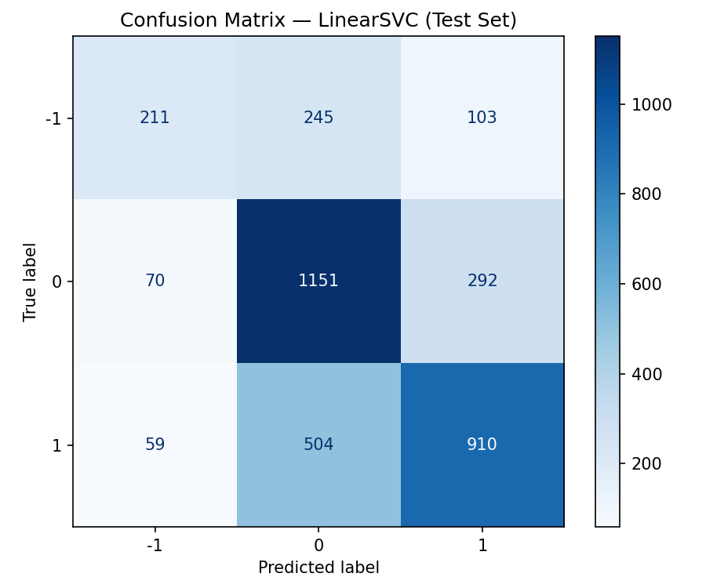

# Answer Grading for Short Answers

Final project for the Natural Language Processing course.  
Automatically grades short answers from community Q&A forums using classical machine learning on the SemEval-2013 CQA dataset.

---

## Problem Statement

Given a short answer text, classify it into one of **three quality levels**:

| Label | Meaning |
|-------|---------|
| `-1` | Bad — irrelevant or incorrect answer |
| `0` | Neutral — potentially useful but incomplete |
| `1` | Good — correct and relevant answer |

Framed as a **multi-class text classification** task.

---

## Dataset

**SemEval-2013 Community Question Answering (Task 3)**  
Source: [Kaggle — SemEval-datasets](https://www.kaggle.com/datasets/azzouza2018/semevaldatadets)

| File | Purpose |
|------|---------|
| `semeval-2013-train.csv` | Model training |
| `semeval-2013-dev.csv` | Validation / hyperparameter tuning |
| `semeval-2013-test.csv` | Final evaluation |

Each CSV has two columns: `text` (the answer string) and `label` (-1, 0, or 1).

> **Note:** Dataset files are included in this repository. 

---

## Project Structure

```
NLP-Project/
│
├── preproc.py               # Text cleaning + TF-IDF vectorization
├── model.py                 # Model training
├── eval.py                  # Full evaluation
│
├── results/
│   ├── confusion_matrix.png # 3x3 confusion matrix for best model
│   ├── results_summary.csv  # All metrics across models and splits
│   └── errors.csv           # Misclassified examples (error analysis)
│
├── artifacts/               # Saved model + vectorizer (generated on run)
│   ├── best_model.pkl
│   ├── tfidf_vectorizer.pkl
│   └── label_encoder.pkl
│
├── NLP_Project_Report.docx  # Final project report
└── README.md
```

---

## Setup

### 1. Clone the repository
```bash
git clone https://github.com/EventHorizon33/NLP-Short-Answer-Grading.git
cd NLP-Short-Answer-Grading
```

### 2. Install dependencies
```bash
pip install pandas scikit-learn nltk matplotlib
```

### 3. Download the dataset (optional, because the dataset is included in the repository)
Download from [Kaggle](https://www.kaggle.com/datasets/azzouza2018/semevaldatadets) and place in the project root:
- `semeval-2013-train.csv`
- `semeval-2013-dev.csv`
- `semeval-2013-test.csv`


---

## Usage

```bash
# Step 1 - Preprocess (optional standalone check)
python preproc.py

# Step 2 - Train the model
python model.py

# Step 3 - Evaluate 
python eval.py
```

Output saved to `results/` and `artifacts/`.

---

## Pipeline

```
Raw CSV  ->  Clean Text  ->  TF-IDF Vectors  ->  Classifier  ->  Evaluation
```

| Step | Details |
|------|---------|
| Preprocessing | Lowercase, remove URLs/mentions/hashtags, strip punctuation, remove stopwords, lemmatize |
| Vectorization | TF-IDF, top 10,000 features, unigrams + bigrams, sublinear TF scaling |
| Models | Logistic Regression, LinearSVC (both with C=1.0, one-vs-rest multi-class) |
| Evaluation | Accuracy, Precision, Recall, F1 (weighted + macro), 3x3 Confusion Matrix, Error Analysis |

---

## Results

| Model | Split | Accuracy | F1 (weighted) |
|-------|-------|----------|----------------|
| Logistic Regression | Dev  | 0.6272727272727273 | 0.6016087766457409 |
| Logistic Regression | Test | 0.6493653032440057 | 0.6296786665097807 |
| LinearSVC           | Dev  | 0.6260606060606061 | 0.6157163089803738 |
| LinearSVC           | Test | 0.6409026798307476 | 0.6341102894086955 |


### Confusion Matrix (LinearSVC - Test Set)



Classes: **-1** = Bad, **0** = Neutral, **1** = Good

---

## Dependencies

| Package | Version |
|---------|---------|
| Python | 3.8+ |
| scikit-learn | >= 1.0 |
| pandas | >= 1.3 |
| nltk | >= 3.7 |
| matplotlib | >= 3.4 |

---

## References

1. Nakov et al. (2015). SemEval-2015 Task 3: Answer Selection in Community Question Answering. Proceedings of SemEval-2015.
2. Pedregosa et al. (2011). Scikit-learn: Machine Learning in Python. JMLR, 12, 2825-2830.
3. Bird, Klein & Loper (2009). Natural Language Processing with Python. O'Reilly Media.
